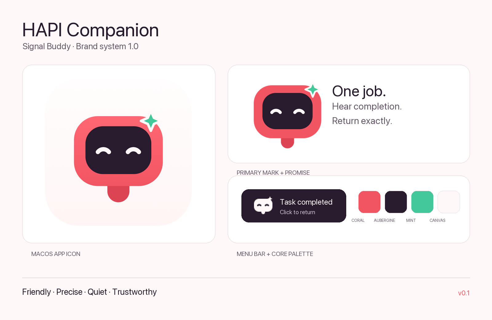

# HAPI Companion brand guidelines

**Version:** 1.0  
**Status:** approved for the v0.1 source release  
**Direction:** Signal Buddy  
**Updated:** 2026-09-05

## Brand definition

HAPI Companion is HAPI's calm native attention layer on macOS: it makes completion audible and returns the user to the exact conversation. It is friendly, precise, quiet, and trustworthy—not loud, gamified, or a second HAPI client.

**One-line message:** Hear completion. Return exactly where the work happened.

## Logo system

The Signal Buddy symbol combines four functional cues:

- coral rounded body: relationship to HAPI;
- dark status screen: coding-agent state;
- bell clapper: audible notification;
- mint sparkle: task completed.

The authoritative master is [`../../brand/logo/signal-buddy-mark.svg`](../../brand/logo/signal-buddy-mark.svg). It contains editable vector geometry and no embedded raster image. The horizontal lockup uses system typography and is an approved derived asset, not a bespoke wordmark.

### Variants and files

| Preview | File | Status | Use |
|---|---|---|---|
|  | [`signal-buddy-mark.svg`](../../brand/logo/signal-buddy-mark.svg) | approved-master | Default symbol |
| Dark monochrome | [`signal-buddy-mark-mono-dark.svg`](../../brand/logo/signal-buddy-mark-mono-dark.svg) | approved-master | Light, single-color surfaces |
| Light monochrome | [`signal-buddy-mark-mono-light.svg`](../../brand/logo/signal-buddy-mark-mono-light.svg) | approved-master | Dark, single-color surfaces |
| Horizontal | [`hapi-companion-horizontal.svg`](../../brand/logo/hapi-companion-horizontal.svg) | approved-derived | README and wide layouts |
|  | [`signal-buddy-app-icon.svg`](../../brand/app-icon/signal-buddy-app-icon.svg) | approved-master | macOS application identity |
| Menu bar | [`signal-buddy-menubar.svg`](../../brand/menu-bar/signal-buddy-menubar.svg) | approved-master | macOS template icon |

### Clear space and minimum size

- Keep clear space equal to one eye-arc width around the symbol.
- Use the full-color symbol at 32 px or larger.
- At 16–31 px, use the dedicated monochrome menu-bar artwork.
- Never add a second notification badge: the mint sparkle already conveys completion.

### Do not

- stretch, rotate, outline, recolor individual facial elements, or separate the clapper;
- replace coral with platform blue or turn the mint sparkle red;
- add Wi-Fi arcs, count badges, gradients outside the app icon, or text inside the symbol;
- use the concept PNG as a vector master.

## Color

| Role | Value | Guidance |
|---|---|---|
| Companion Coral | `#F25562` | Identity, never body copy |
| Coral Dark | `#DC4454` | clapper/depth only |
| Completion Mint | `#42C89A` | small accent; pair with shape/text |
| Warm Canvas | `#FFF8F8` | primary light backdrop |
| Deep Aubergine | `#281B2D` | screen and primary text |
| Muted Ink | `#655869` | secondary text on white/warm canvas |

Deep Aubergine on Warm Canvas has strong text contrast. Coral and Mint are identity/status accents and must not be the only carrier of critical information.

## Typography

Use San Francisco through the system stack for the macOS product and documentation UI. Use SF Mono/system monospace for commands, IDs, and logs. No third-party font license is required. Use semibold headings, regular body copy, sentence case, and short operational language.

## Shape, layout, and motion

- rounded, compact panels; 4-point spacing rhythm;
- one focal action or status per surface;
- avoid decorative dashboards or glass effects;
- completion motion, if introduced later, should be one 160–240 ms sparkle pulse—never continuous animation.

## Product application

The app icon uses restrained depth for macOS. The menu-bar mark is pure monochrome and template-rendered so macOS controls light/dark appearance. Notifications use the app icon, direct titles, and short body text; the brand never competes with the user's task content.

## Asset package

- Manifest: [`../../brand/manifest.csv`](../../brand/manifest.csv)
- Checksums: [`../../brand/CHECKSUMS.sha256`](../../brand/CHECKSUMS.sha256)
- Rebuild: `./scripts/generate-brand-assets.sh`
- Release archive: generated with `./scripts/package-release.sh`

Print assets, photography, presentation templates, and a custom wordmark are not applicable to this small native utility. Trademark clearance and official HAPI endorsement are not claimed.
